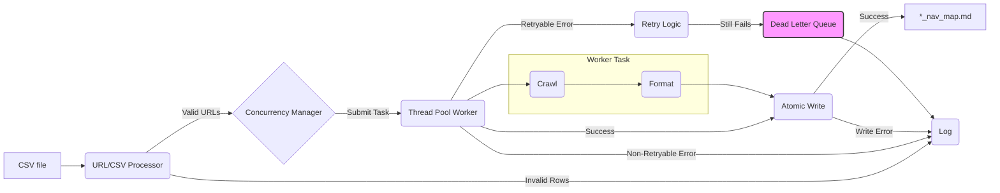

# Codebase Summary

## Overview

This project aims to generate navigation map markdown files for websites based on URLs provided in CSV files. It involves processing CSVs, validating URLs, crawling website navigation menus, and generating tree-structure diagrams in markdown format.

## Key Components

1.  **`src/csv_processor.py`:**
    - Reads CSV files from `input_csvs/`.
    - Validates URLs and CSS selectors per row.
    - Logs errors for invalid rows/missing data.
    - Returns a list of unique `(url, css_selector)` pairs.
2.  **`src/utils.py`:**
    - Provides `get_website_name` for generating filesystem-safe names from URLs.
    - Includes a `@retry_with_backoff` decorator for handling transient errors (used in `crawler.py`).
3.  **`src/crawler.py`:**
    - `fetch_html`: Fetches website content using `requests` with retry logic via decorator.
    - `find_nav_links`: Parses HTML using `BeautifulSoup` to find links within a specified CSS selector.
    - `crawl_navigation`: Performs breadth-first traversal of navigation links within the same domain, handling visited URLs and displaying progress using `tqdm`. Returns a nested dictionary representing the site structure.
    - `format_tree`: Converts the nested dictionary into a markdown tree string.
4.  **`src/file_writer.py`:**
    - `generate_filename`: Creates the output filename (e.g., `output_maps/example_com_nav_map.md`).
    - `write_map_file`: Writes content atomically using `tempfile` and `os.rename`. Implements basic file locking (`.lock`) with stale lock cleanup.
5.  **`src/concurrency_manager.py`:**
    - Manages a `ThreadPoolExecutor` for concurrent task execution.
    - Defines `process_single_url_task` worker function orchestrating crawl -> format -> write.
    - Implements a simple file-based Dead Letter Queue (`dlq.log`) for tasks failing after retries (retries handled within `fetch_html`).
    - Provides `process_tasks` method to submit and manage multiple tasks.
6.  **`src/main.py`:**
    - Entry point for the application.
    - Sets up logging.
    - Loads URL/selector pairs using `csv_processor`.
    - Implements the CLI for user selection.
    - Uses `ConcurrencyManager` to execute the selected task.
    - Handles results and manager shutdown.
7.  **`src/logger_config.py`:**
    - Configures console and rotating file (JSON format) logging.
    - Includes thread information in logs.
8.  **`tests/`:** Contains initial unit tests for `utils`, `csv_processor`, and `crawler` modules using `unittest`.

## Data Flow

## External Dependencies

- See `tech_stack.md` for details on libraries and environment.

## Recent Significant Changes

- Initial project setup and Memory Bank initialization.
- Implemented core modules: `csv_processor`, `utils`, `crawler`, `file_writer`.
- Implemented `concurrency_manager` with ThreadPoolExecutor, DLQ, and worker task logic.
- Implemented `main.py` CLI integration.
- Added initial unit tests in `tests/`.
- Updated Memory Bank documents through Phase 4 completion.
- Fixed crawler bug causing duplicate URLs in output.
- Added `tqdm` progress bar to crawler.

## User Feedback Integration

- N/A at this stage.

## Additional Documentation

- `implementation_plan.md`: Detailed step-by-step plan for project development.
- `tests/`: Directory containing unit tests.
