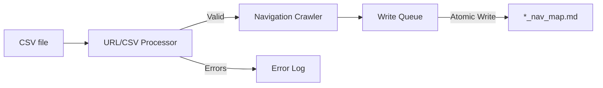

# Codebase Summary

## Overview

This project aims to generate navigation map markdown files for websites based on URLs provided in CSV files. It involves processing CSVs, validating URLs, crawling website navigation menus, and generating tree-structure diagrams in markdown format.

## Key Components

1.  **URL/CSV Processor:** Reads and validates URLs from CSV files located in a designated project root folder. Handles errors gracefully without blocking other valid entries.
2.  **Navigation Crawler:** Traverses website navigation menus recursively, extracts page details (name, URL, last updated), and generates the markdown tree diagram. Outputs files to a designated project root folder.
3.  **Concurrency System:** Manages concurrent processing of URLs, likely using a thread-per-row approach with a write queue and file locking for safe markdown file generation.
4.  **User Interface (CLI):** Provides a command-line interface for users to select which validated URL from the CSV(s) to process.

## Data Flow

## External Dependencies

- See `tech_stack.md` for details on libraries and environment.

## Recent Significant Changes

- Initial project setup and Memory Bank initialization.

## User Feedback Integration

- N/A at this stage.

## Additional Documentation

- N/A at this stage.
