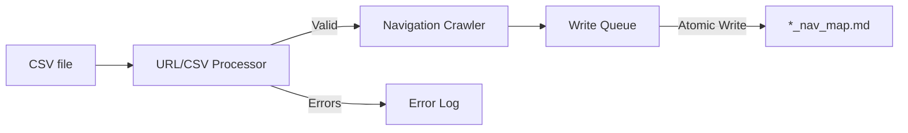

# Project Brief

## Project Goals

Create and maintain a series of markdown files that each contain a tree structure diagram representation of a website navigation menu.

## Requirements

- Create a tree structure diagram of the contents of a website navigation menu.
- Accept multiple website URLs and produce a tree structure diagram for each website where each branch represents a unique webpage.
- Output each website's tree structure diagram as a markdown file adhering to naming convention `<website name>_nav_map.md`.
- Save each `<website name>_nav_map.md` file to the same folder in the project root directory.
- User must share list of website URLs via a CSV file (or files) saved to a folder in the project root directory.
- Each CSV file must contain a two column table that contains website full path URLs and navigation selector.
- Example CSV file content:
  url,css_selector
  https://example.com,.nav-menu
  https://test.com,#main-navigation
- Each file's contents must be validated before executing downstream processes.
- If the contents of any row in the file fail validation, this should not block:
  - Other rows of the CSV file from being validated.
  - Downstream processes of other rows that pass validation.
- User must trigger the creation of a `<website name>_nav_map.md` by:
  1. Executing the relevant script in Terminal.
  2. Terminal must display a numbered list of the URLs (without the protocol) from the CSV file (or files) with a user entry prompt.
  3. User must enter a number that corresponds to a list item.
  4. Terminal must reject non-valid user entries and continue to request a user entry.
  5. Terminal must accept "exit" as an early termination prompt.
  6. If user entry is validated, this should trigger downstream processes to create `<website name>_nav_map.md`.
- The script that crawls the website must:
  - Exhaustively traverse all sub-menus of a website's navigation menu.
  - Identify each webpage listed in the navigation menu.
  - Extract the following webpage details: name, full path URL, and last updated timestamp (where available).
- The full contents of each `<website name>_nav_map.md` file must only be a tree structure diagram.
- Example content of `<website name>_nav_map.md`:
  ```
  https://www.example.com/
  ├── https://www.example.com/about/
  ├── https://www.example.com/services/
  │   ├── https://www.example.com/services/website-copywriting/
  │   └── https://www.example.com/services/vip-day/
  └── https://www.example.com/privacy-policy/
  ```

### Error Handling

Implement robust error handling for:

1.  **Network Errors:**
    - Use `try-except` blocks to catch `requests.exceptions.RequestException` during URL fetching.
    - Log error messages, including the URL that caused the error.
    - Implement retry logic with exponential backoff for transient network errors.
    - If a link is broken, log the error, and continue to the next link.
2.  **HTML Parsing Errors:**
    - Use `try-except` blocks to catch `BeautifulSoup` parsing errors.
    - Log error messages, including the URL and the parsing issue.
    - Use robust HTML selectors to minimize parsing failures.
3.  **File I/O Errors:**
    - Use `try-except` blocks to catch file I/O errors (e.g., `IOError`).
    - Log error messages, including the file path and the error details.
    - Ensure proper file permissions and directory existence.
4.  **Logging:**
    - Implement comprehensive logging to track the execution of the scripts.
    - Log informational messages, warnings, and errors.
    - Use a structured logging format (e.g., JSON) for easier analysis.

## External dependencies

- **Core Libraries**

  - BeautifulSoup4: HTML parsing
  - Requests: HTTP requests
  - Python csv module: CSV processing with validation

- **Infrastructure**
  - Python 3.10+: Runtime environment
  - Git: Version control

## Key Components

1. **URL/CSV Processor**

   - Reads URLs from CSV files stored in a folder in root
   - Validates and normalizes URLs
     - Strict URL format validation
     - Automatic whitespace trimming
     - Line number tracking for errors
     - Non-blocking validation (continues processing valid rows)

2. **Navigation Crawler**

   - Generates markdown files stored in a folder in root
   - Uses recursive traversal for nested menus
   - Outputs tree structure diagrams

## Data Flow



## Completion Criteria

The project will be considered complete when:

- Documentation is complete and clear
- Project is on a public GitHub repo and contains at least one `<website name>_nav_map.md` file.
- Code passes all validation checks
